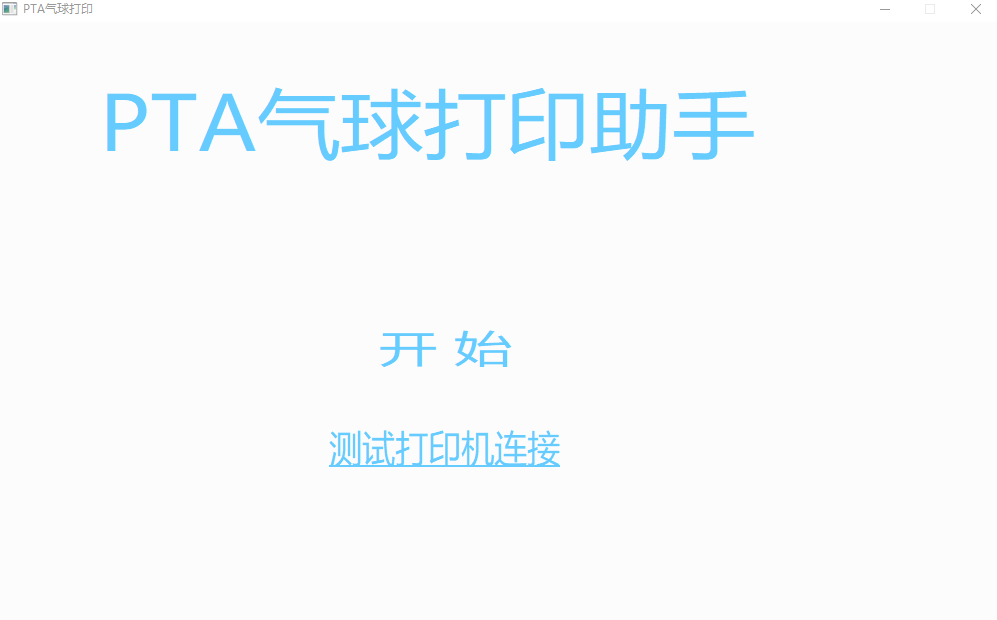
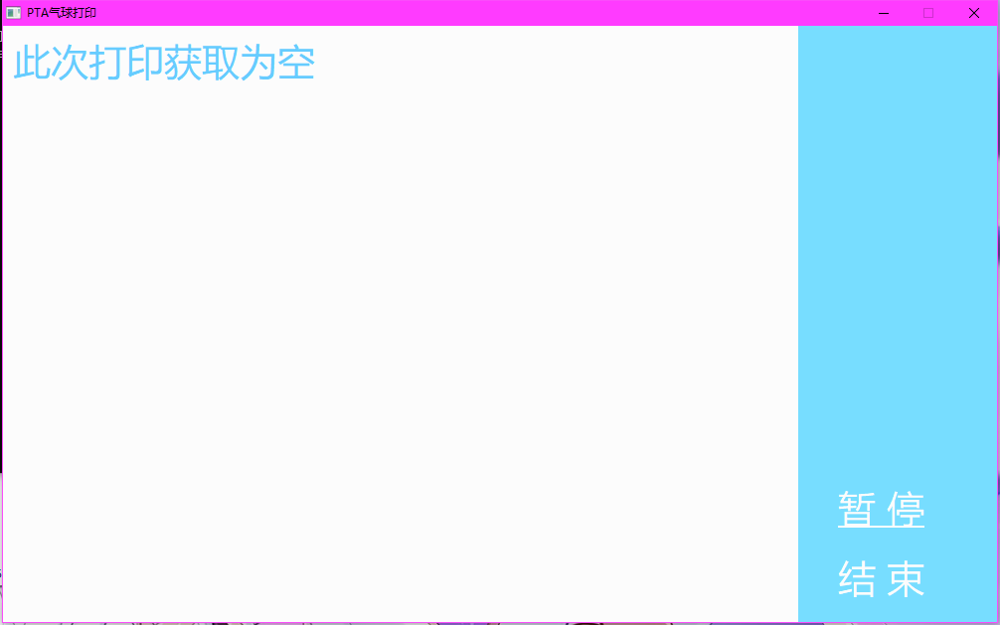

# PTA气球打印程序

用于获取pintia平台比赛时后台气球数据并打印的气球小票用于给志愿者派送气球的小程序

# 配置

### 环境要求
需要以下python库
1. json
2. requests
3. codecs

需要一台电脑并且连接用于打印气球小票的打印机
`该打印机需要设置为默认打印机`

连接完成后运行PTA文件夹内的`PTA气球打印.exe`，点击测试打印机连接，如果打印机已经成功连接上电脑，那么将会打印一张带有打印机成功连接信息的小票。



然后需要配置`get_balloon.py`
请修改代码文件的以下部分：

```python
problem_set_id = "" # problem set id为比赛id

cookie = {
	# 此处填写cookie，格式如下
	# "PTASession": "xxxxxx"
}
```

示例：
```python
problem_set_id = "1234567890"

cookie = {
	"PTASession": "3oias234ijasdpo"
}
```

PTASession在气球网页界面F12查看cookies可以看到

最后运行`PTA气球打印.exe`点击开始即可开始监控比赛的气球状态

# 操作界面
包括前端的GUI和后端的控制台窗口

控制台窗口主要用于在程序遇到问题（网络访问失败之类的异常）时输出错误信息方便进行测试

前端的GUI窗口可以暂停当前的打印，来进行纸张的更换
点击暂停键暂停，之后点击继续键继续打印。结束键退出程序（虽然直接关闭程序窗口就可以结束了OwO）


# 其他

程序使用的是电脑的打印机，所以暂时无法同时连接两个打印机即用来进行代码打印又用来进行气球小票打印（会打印到同一个默认打印机去QAQ）

source文件夹内的`GUI.cpp`是`PTA气球打印.exe`的C++源代码，用到了EGE的图像处理库，可以修改cpp文件并重新编译以修改气球小票的打印格式。`No_GUI.cpp`则没有用到图像库，可以直接编译。
